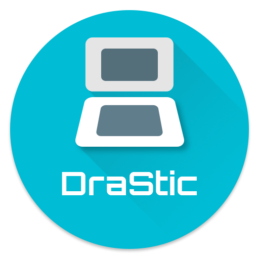

<div align=center>



</div>
<h1 align=center>Drastic DS · Switch Port</h1>

A native wrapper/port of Drastic DS Emulator to the Nintendo Switch.
It loads the original Android ARM64 emulator core `libdrastic_arm64.so`,
patches it, and runs it inside a minimal Android-like
environment natively.

Everything ships as a **single `DrasticDS.nro`**: it bundles the build-supplied
Drastic core, game database and cheat table, one runtime-selectable Mesa host
for Vulkan/NVK, native OpenGL/NVC0 and OpenGL-on-NVK through Zink, 56
ready-to-use custom shaders, and an SDL cover-art launcher.
Nintendo DS BIOS and firmware are never packed into the NRO.

### How to install

1. Copy `DrasticDS.nro` into `/switch/` on your SD card.
2. Copy your own Nintendo DS system dumps into `/switch/drastic/system/`:
   * `nds_bios_arm7.bin` — 16 KiB ARM7 BIOS.
   * `nds_bios_arm9.bin` — 4 KiB ARM9 BIOS.
   * `nds_firmware.bin` — 256 KiB firmware.
3. Put legally obtained `.nds`, `.zip`, or `.rar` games in
   `/switch/drastic/games/`, or add another SD, USB, or SMB library folder from
   **Settings > Library & storage**.

The launcher creates the rest of the folder tree and extracts the unified host
and bundled application resources on demand:

```text
/switch/DrasticDS.nro
/switch/drastic/
  .emu/                   <- hidden runtime host, extracted when first needed
    DrasticDS_nx.nro      <- Vulkan/NVK + OpenGL/NVC0 + Zink
  cache/
  cheats/                 <- custom Action Replay files
  cores/                  <- Drastic ARM64 core, auto-extracted
  covers/                 <- cover art (<game-key>.png)
  forwarders/             <- HOME-menu shortcut working data
  gamecfg/                <- per-game launcher settings
  games/                  <- default ROM library
  lsfg/                   <- optional user-supplied Lossless.dll
  microphone/             <- optional microphone samples
  scripts/                <- Lua scripts
  shaders/                <- custom DraStic .dfx/.dsd post-FX shaders
    Bundled/              <- auto-installed OpenGL sources + Vulkan packs
  slot2/                  <- Slot-2 data
  system/
    nds_bios_arm7.bin     <- your ARM7 BIOS dump (you supply)
    nds_bios_arm9.bin     <- your ARM9 BIOS dump (you supply)
    nds_firmware.bin      <- your firmware dump (you supply)
    game_database.xml     <- auto-extracted Drastic database
    usrcheat.dat          <- cheat database (installed once; user-replaceable)
  user/backup/            <- cartridge save files
  user/savestates/        <- save states and previews
  launcher.ini            <- launcher settings
  drastic.ini             <- effective settings for the next launch
```

### Default controls

* **L + R + Plus** — open the in-game menu.
* **ZR** — fast-forward; hold/toggle behavior is configurable.
* **ZL** — swap the DS screens.
* **Touch screen** — stylus input on the displayed bottom DS screen.
* **Right Stick + R-Stick** — docked-mode analog stylus and touch press.
* **L-Stick** — Drastic white-noise microphone input when the simulated source
  is selected.
* **L + R + Minus + Y / X** — save/load the current state slot.
* **L + R + Minus + Up / Down** — change the state slot.
* **L + R + Minus + A** — reset the emulated DS.

Every runtime hotkey can be rebound to a button combination under
**Settings > Controller**.

### Microphone input

Choose **Settings > Audio > Microphone source** before launching a game, or
change it at runtime from **Audio, input & motion** in the in-game menu.
**Simulated noise** retains the microphone hotkey for games that only require
blowing. **External microphone** captures real audio from a CTIA-compatible
headset connected to the 3.5 mm jack or a compatible USB audio input. Attached
USB inputs are preferred automatically, and reconnecting or unplugging a
device is handled while the game is running. Bluetooth microphone input is not
supported by Nintendo Switch.

### Slot-2 accessories

Choose the accessory before launching a game under
**Settings > Gameplay / Features > Slot-2 accessory**. The complete native
Drastic set is available: None, GBA Cart, SRAM Cart, Rumble Pack, Motion Pack
(Official), and Motion Pack (Homebrew).

For GBA Cart, put the GBA ROM and its raw cartridge save in
`/switch/drastic/slot2/`. Name them after the DS ROM (for example,
`Pokemon Platinum.gba` and `Pokemon Platinum.sav` for
`Pokemon Platinum.nds`). `slot2_gamepak.gba` and `slot2_gamepak.sav` can be
used as the shared fallback pair. The DS and GBA releases still need to be
region-compatible, and only games with Slot-2 connectivity can use them.

### Notes

This will not run in applet/album mode. It needs the full memory and JIT
services of a game override. Launch it by holding **R** while opening an
installed title, or use a forwarder.

The launcher supports multiple library folders across SD, USB mass storage,
and SMB shares, cover downloads, themes, a file manager, and HOME-menu
shortcut creation.
Use **Settings > Launcher > Launcher rotation** to select 0, 90, 180, or 270
degrees. The 90 and 270 degree modes reflow the complete SDL launcher for
vertical/tate use, while 0 and 180 retain its landscape layout. Touch follows
the displayed UI; D-Pad and stick menu directions remain physically mapped as
normal.

Press **L + R + Plus** to open the in-game menu for save states, per-title
Action Replay cheats, screen layout and filter controls, emulation/audio/input
settings, frame generation, reset, and return to the launcher.
At 90 or 270 degrees, the menu, filter preview bar, layout editor, and FPS HUD
use a portrait canvas while menu controls keep their normal orientation.

**Settings > Graphics > Low-latency Vulkan** is an optional mode, disabled by
default. It uses the minimum FIFO swapchain depth and synchronizes DraStic's
next emulated frame with image acquisition instead of allowing an extra
completed frame to queue. The dedicated HID sampler continues updating
controls independently while the renderer waits, so input is not tied to the
display loop. OpenGL ignores this option.

LSFG 2x Frame Generation is available with the Vulkan renderer under
**Settings > Frame Generation**. You must provide your own `Lossless.dll` at
`/switch/drastic/lsfg/Lossless.dll`. LSFG must be enabled before launching a
game so the Vulkan device and swapchain can be prepared; it can then be toggled
from the in-game menu. For the lowest controller-to-screen latency, leave LSFG
disabled: generated frames necessarily add presentation latency and its deeper
swapchain takes precedence over Low-latency Vulkan. Also enable Game Mode on
the connected TV or monitor when playing docked.

Nearest, linear, Quilez, scanline, Scale2x, HQ2x, FXAA, FXAA HQ, and SMAA use
Drastic's original Android post-FX programs on every backend. Native NVC0 and
Zink execute the generated GLES programs directly. Vulkan executes SPIR-V
generated from the same `.dfx`/`.dsd`.

### Custom shaders

The original DraStic Android `.dfx` format is supported by every backend,
including multi-pass chains, headers/includes, framebuffer targets, output
scaling, named samplers, and raw lookup textures. Copy a shader's complete
folder tree to `/switch/drastic/shaders/`, then choose **Custom shader** under
**Settings > Graphics** or from the dedicated in-game custom-shader preview.

OpenGL compiles `.dfx`/`.dsd` sources directly when selected. Vulkan has no
runtime GLSL compiler, so each custom shader needs an adjacent SPIR-V pack.
With `glslangValidator` installed, generate it on a PC from this repository:

```sh
python3 tools/compile_custom_shader.py "/path/to/My Shader.dfx"
```

The command validates the OpenGL program and creates
`My Shader.dfx.nxvk/` beside the manifest. Copy that directory along with the
`.dfx`, `.dsd`, include, and `.raw` files while preserving relative paths. A
whole shader directory can be passed instead of one file to compile every
`.dfx` recursively. The launcher marks missing Vulkan packs and blocks that
invalid launch instead of silently substituting another filter or renderer.

### How to build

Install the devkitPro Switch toolchain and portlibs:

```sh
pacman -S devkitA64 switch-tools libnx switch-sdl2 switch-sdl2_ttf \
          switch-sdl2_image switch-curl \
          switch-zlib switch-zstd cmake ninja git python \
          mingw-w64-ucrt-x86_64-glslang
```

```text
DrasticDS/
  com.dsemu.drastic_r2.6.0.4a-109_minAPI14(arm64-v8a)(nodpi)_drasticds.com/
  mesa-switch-unified-sdk/
  DrasticDS_nx/
```

```sh
JOBS=16 DRASTIC_APK_DIR=/path/to/extracted-apk \
  MESA_SDK_DIR=/path/to/mesa-switch-unified-sdk bash ./build_all.sh
```

### Credits

* Drastic developers.
* fgsfds for the Switch so-loader groundwork reused here.
* TheOfficialFloW for the original Android so-loader lineage.
* Dantiicu for the Switch Vulkan driver.
* PancakeTAS for LSFG-VK.
* Slluxx for IconGrabber.
* jdgleaver and the original RetroArch shader authors for the bundled DraStic
  shader collection; individual source headers retain full attribution.

### Support

If you enjoy my work and want to support me:

[](https://ko-fi.com/D1D1P2MOG)

### Legal

This project has no affiliation with Exophase or the Drastic developers.
Drastic is proprietary software. No emulator core, BIOS, firmware, database,
cheat table, `Lossless.dll`, or game image is distributed in this repository;
you must supply legally obtained copies. The generated NRO intentionally
contains no Nintendo DS BIOS or firmware. Do not redistribute an NRO containing
other proprietary material unless you have the necessary rights. We do not
condone piracy.

Unless noted otherwise, the wrapper source is under the MIT License (see
`LICENSE`). The vendored LSFG-VK subset under `third_party/lsfg-vk` is
GPL-3.0-or-later.